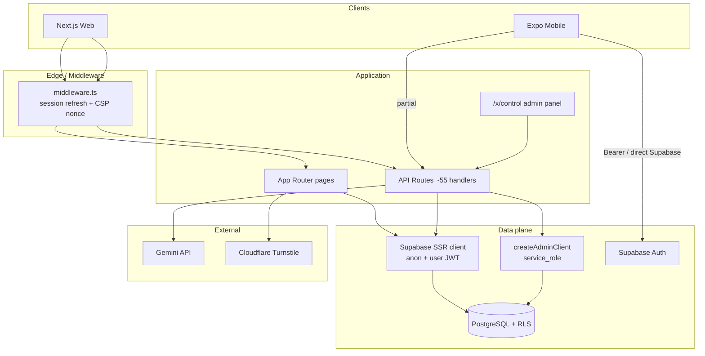
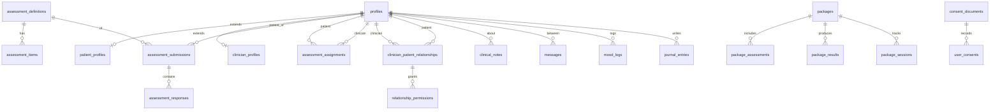

# V Welfare — Architecture Report

**Platform:** V Welfare (mental healthcare / psychometric assessment)  
**Repository:** assessment-project  
**Audit date:** 2026-07-13  
**Stack:** Next.js 14.2.35 · React 18 · TypeScript 5 · Supabase (Auth + Postgres + Realtime) · Vercel · Expo (mobile) · Gemini API  
**Status:** Evidence-based architecture review. No code was modified for this report.

---

## 1. Overall Architecture

V Welfare is a bilingual (EN/AR, RTL) mental-health SaaS deployed as:

| Layer | Technology | Role |
|-------|------------|------|
| Web app | Next.js 14 App Router on Vercel | SSR pages, API routes, middleware |
| Mobile | Expo Router (~54) in `/mobile` | Patient-facing native client |
| Auth | Supabase Auth (email/password) | Sessions via `@supabase/ssr` cookies |
| Database | Supabase PostgreSQL + RLS | PHI, assessments, consent, audit |
| Admin step-up | HMAC `admin_session` cookie | PIN-gated `/x/control` panel |
| AI | Google Gemini (`GEMINI_API_KEY`) | Chat, synthesis, clinical note drafts, package interpret |
| CAPTCHA | Cloudflare Turnstile (optional) | Login/register/guest submit |
| Rate limiting | Supabase RPC `check_and_record_rate_limit` | Atomic DB counters (Redis wrapper unused) |
| PDF | `@react-pdf/renderer` | Patient reports + package exports |
| CDN / headers | Vercel + `middleware.ts` CSP | HSTS, CSP nonce, frame denial |



**Architectural principle in practice:** Most mutating API routes authenticate with the user SSR client, then perform writes with `createAdminClient()` (service role), bypassing RLS. Security therefore depends on **route-level authorization**, not only database policies.

---

## 2. Folder Organization

```
/workspace
├── app/                      # Next.js App Router
│   ├── (app)/                # Authenticated patient/clinician shell + sidebar
│   ├── (auth)/               # Login, register, forgot/reset password
│   ├── api/                  # ~55 route handlers
│   ├── auth/confirm/         # Email confirmation / OTP exchange
│   ├── connect/              # Clinician invitation accept flow
│   ├── x/control/            # Obfuscated admin control panel
│   ├── onboarding/           # Post-signup wizard
│   ├── privacy|terms|contact # Public legal/marketing
│   ├── robots.ts / sitemap.ts
│   └── layout.tsx / error.tsx / not-found.tsx
├── components/               # Shared UI (~21 components)
├── lib/
│   ├── supabase/             # browser, server, admin clients
│   ├── security/             # PHI scrubber, Turnstile, file-export, AI budget
│   ├── rate-limit.ts         # DB rate limiter (+ unused redis.ts)
│   ├── admin-auth.ts         # requireAdmin + HMAC
│   ├── permissions.ts        # UI permission labels
│   ├── assessment-content*.ts# Large static assessment copy
│   ├── i18n.ts / get-language.ts / use-lang.ts
│   └── types.ts
├── mobile/                   # Expo patient app (separate package.json)
├── supabase/migrations/      # 100 migration files (~73 stubs)
├── __tests__/security/       # RLS/IDOR/PHI tests
├── load-tests/               # k6 scenarios (100–1000 VUs)
├── docs/                     # Disaster recovery
└── audit/                    # This audit deliverable set
```

**Observations:**
- Thin shared component layer; most UI lives in page/`*-content.tsx` files.
- Dual admin surfaces: `/x/control/*` (primary) and `/admin/*` inside `(app)` (KPI/settings).
- No monorepo package sharing between web and mobile (duplicated types/i18n).

---

## 3. Data Flow

### 3.1 Authenticated assessment submission

```
Patient answers questions (client, localStorage progress)
  → POST /api/submit-assessment
  → SSR getUser() auth
  → Rate limit 20/hr/user
  → Validate responses against assessment_items options
  → Score + high-risk (safety items + threshold)
  → RPC submit_assessment_atomic via service_role client
  → Optional: mark assessment_assignments completed
  → Fire-and-forget: admin high-risk notifications + audit_log
  → JSON result → client renders score/band/crisis UI
```

### 3.2 Guest assessment

```
Public guest submit
  → Turnstile + multi-tier rate limits + circuit breaker
  → Insert assessment_submissions (patient_id null) + responses (non-atomic)
  → No account created
```

### 3.3 Clinician–patient connection (intended)

```
Clinician generates invite OR patient shares access code
  → Patient accepts → clinician_patient_relationships + relationship_permissions
```

**Actual runtime gap:** Messaging, assignments, clinical notes, and much RLS still require `profiles.assigned_clinician_id`, which application code never sets after consent. See bug/security reports.

### 3.4 Admin analytics

```
Admin PIN login → admin_session cookie
  → /api/admin/dashboard/* → RPC against matviews (schema partially broken)
  → /api/admin/dashboard/risk → queries base tables directly (documented workaround)
```

---

## 4. Authentication Flow

### End users (patient / clinician)

1. Register (`app/(auth)/register`) — client validation, optional Turnstile, optional rate-limit pre-check, then `supabase.auth.signUp()`.
2. Email confirm (`app/auth/confirm`) — PKCE code or OTP hash; `safeNext()` redirect allowlist.
3. Login (`app/(auth)/login`) — rate-limit pre-check + optional Turnstile, then `signInWithPassword()` **directly to Supabase** (not via a server login route).
4. Middleware refreshes session via `auth.getUser()` and gates private path prefixes.
5. Password reset — `POST /api/auth/forgot-password` (rate-limited, anti-enumeration) then client `updateUser({ password })`.

### Admin

1. `POST /api/admin/login` — rate limit → `ADMIN_PIN` → Supabase password → `profiles.role ∈ {admin,superadmin}` → HMAC cookie `admin_session`.
2. `requireAdmin()` on panel pages and most `/api/admin/*` routes re-checks JWT + role + cookie.
3. Middleware only checks Supabase user presence for `/x/control/*`, **not** the PIN cookie.

### Mobile

- Expo Secure Store / AsyncStorage session via `mobile/lib/supabase.ts` and `useAuth`.
- Some API routes accept `Authorization: Bearer` (e.g. AI chat, push tokens).

---

## 5. Authorization Flow

| Layer | Mechanism | Coverage |
|-------|-----------|----------|
| Middleware | Session presence for private pages | Does not authorize roles; does not protect `/api/*` |
| Route handlers | `getUser()` + role / ownership checks | Inconsistent across admin & clinician APIs |
| Admin step-up | `requireAdmin()` HMAC | Most `/api/admin/*`; **not** clinician-verifications, KPI alerts, or RLS |
| RLS | `get_my_role()`, `assigned_clinician_id`, relationship tables | Dual models; some overly broad clinician SELECTs |
| Consent permissions | `relationship_permissions` + SQL `check_relationship_permission()` | Defined; **largely unused** by app routes |

**Roles** (`profiles.role`): `patient` | `clinician` | `admin` | `superadmin`  
Role self-escalation blocked by trigger `prevent_role_self_escalation()`. Role column has **no CHECK constraint** in tracked SQL.

---

## 6. Database Relationships (summary)



Full table inventory and RLS assessment: see `database-report.md`.

---

## 7. Role System

| Role | Intended capabilities |
|------|----------------------|
| patient | Own assessments, mood, journal, packages, messaging, consent grants, GDPR export/delete request |
| clinician | Verification, invite/connect, patient list, assignments, notes, messaging (scoped) |
| admin | Control panel, analytics, users, assessments, packages, exports, announcements, settings |
| superadmin | Admin + grant admin roles |

**UI labels** for granular consent live in `lib/permissions.ts`. API key sets drift from these labels in access-request handlers.

---

## 8. Supabase Usage

| Client | File | Key | Use |
|--------|------|-----|-----|
| Browser | `lib/supabase/client.ts` | anon | Client components, auth forms |
| Server SSR | `lib/supabase/server.ts` | anon + cookies | Pages, auth checks |
| Admin | `lib/supabase/admin.ts` | service_role | Most API writes, exports, guest submit |

**Realtime:** messages enabled via migration.  
**Storage:** clinician certificate upload **not implemented** (UI: “Document upload coming soon”).  
**Edge Functions:** none in repo.  
**Migrations:** 100 files; **~73 are stubs** (“Applied directly to remote database”) — local history cannot reproduce production schema.

---

## 9. API Structure

Grouped by domain:

| Domain | Paths | Notes |
|--------|-------|-------|
| Auth | `/api/auth/*` | Limits, captcha, forgot-password |
| Assessments | `submit-assessment`, `submit-assessment-guest`, `score-assessment`, `recommend-assessments`, `check-rescreening` | Strong validation on authenticated submit |
| Packages | `/api/packages/[id]/compute\|interpret` | Feature-flagged |
| Clinical | `clinical-notes`, `assignments`, `reports` | Legacy assignment model |
| Consent | `access-requests`, `relationships`, `patient/*`, `clinician/*`, `connect/[token]` | New model |
| User | `export-data`, `delete-request`, `push-token`, `notifications` | Delete is audit-only |
| AI | `ai-chat`, `synthesis`, `notify-*` | Rate + budget guards |
| Admin | `/api/admin/**` | HMAC on most; gaps exist |
| Health | `/api/health` | Public |

Full route matrix: see `bug-report.md` / security report.

---

## 10. State Management

- **No Redux/Zustand.** Server Components fetch where possible; client pages use `useState`/`useEffect` + Supabase client.
- Assessment progress: **localStorage**.
- Language: `lang` cookie + `lib/i18n.ts`.
- Dark mode: `localStorage` + `document.documentElement.classList`.
- Auth session: Supabase cookies (web) / Secure Store (mobile).

---

## 11. Caching

- API responses: `Cache-Control: no-store` in middleware for `/api/*`.
- Admin matviews intended for analytics caching — **broken schema + no refresh cron in repo**.
- Next.js: no Cache Components / `unstable_cache` usage observed.
- Static assessment content bundled in large TS modules (~204KB EN).

---

## 12. File Uploads

- Clinician verification accepts `document_urls` array without storage integration or URL allowlisting.
- UI explicitly defers document upload.
- PDF generation is server-side render, not user upload.
- `lib/security/file-export.ts` handles export Content-Disposition sanitization.

**Verdict:** Upload pipeline is incomplete for license/certificate verification.

---

## 13. Notifications

| Channel | Implementation |
|---------|----------------|
| In-app | `notifications` table + `notification-bell.tsx` |
| High-risk | Server-side insert to admins on submit; redundant `/api/notify-high-risk` |
| Message notify | `/api/notify-message` (assignment-model gated) |
| Consent events | `notification_events` table |
| Push | `push_tokens` + `/api/user/push-token`; mobile Expo notifications lib |

No email/SMS notification provider wired in application code beyond Supabase Auth emails.

---

## 14. Payments

**Not implemented.** No Stripe/billing/checkout routes, tables, or UI. Prior audits mark billing as pre-revenue. Any “packages” in this codebase are **assessment batteries**, not paid product packages.

---

## 15. Assessments Engine

1. Definitions + items + scoring bands in Postgres; governance gate for activation.
2. Client loads questions; validates locally; persists progress in localStorage.
3. Server validates option values, scores, flags safety items / thresholds.
4. Atomic RPC for authenticated path; guest path non-atomic.
5. Interpretation templates + AI synthesis/insights.
6. Packages: multi-assessment compute + interpret (+ PDF).
7. Rescreening checks via `/api/check-rescreening`.

Mobile app currently **bypasses** server scoring (direct insert) — critical divergence.

---

## 16. Clinician Workflow (architectural)

```
Register as clinician → verification form → (upload stub) → admin approval API
  → invite patient / access code → patient consent → relationship + permissions
  → patients dashboard → assign assessments → notes → messages → reports
```

**Implementation status:** Verification/approval UI incomplete; post-consent care path broken by dual access model. Details in clinician audit section of `bug-report.md`.

---

## 17. Admin Workflow

Primary surface: `/x/control/(panel)/*`  
Capabilities present: overview, analytics, users, assessments, packages, results, risk, platform settings/flags, announcements, audit.  
Missing / stubbed: clinician certificate approval UI, payments, KPI alert persistence, some KPIs marked unavailable.

---

## 18. Patient Workflow

```
Signup → verify email → onboarding → dashboard
  → assessments / packages → results → mood / journal / insights
  → connect clinicians → messages (requires assigned_clinician_id)
  → profile → export / delete request
```

Self-service assessments are the most complete path. Clinician-connected care and GDPR deletion are not production-complete.

---

## 19. Research Workflow

- `/api/admin/research` — anonymized aggregates (contains `totalUsers` counting bug).
- `/api/admin/export` — anonymized CSV/PDF with rate limits + audit.
- `/api/admin/analytics` — capped pulls.
- Admin research UI under control panel analytics/results.

No separate IRB/export approval workflow beyond admin HMAC auth.

---

## 20. Deployment Topology

- `vercel.json` — extended timeouts for clinical-notes, synthesis, AI, export, research.
- `next.config.js` — security headers; CSP nonce in middleware.
- Env: see `.env.example` (Supabase, ADMIN_PIN, ADMIN_SESSION_SECRET, Turnstile, Gemini, Upstash unused).
- DR plan: `docs/DISASTER_RECOVERY.md` (RPO 4h / RTO 8h; PITR upgrade called out).

---

## 21. Architecture Risks (summary)

1. **Service-role-centric writes** concentrate trust in route code.
2. **Dual clinician access models** (`assigned_clinician_id` vs relationships).
3. **Stub migrations** prevent reproducible deploys / audits.
4. **Admin step-up not bound to RLS** — admin JWT alone can read PHI.
5. **Web/mobile split** — scoring and feature parity diverge.
6. **No payments module** despite product expectations in some docs.

---

## Final Architecture Verdict

The platform has a coherent Next.js + Supabase foundation with thoughtful healthcare features (high-risk flags, consent tables, audit logs, bilingual RTL, admin HMAC). It is **not yet architecturally consistent** for clinician-connected care or reproducible database ops. Treat as **limited patient self-service beta-capable**; **not** as a complete clinician–patient production system until the dual-model and migration hygiene issues are resolved.

**Architecture readiness score: 58/100**
